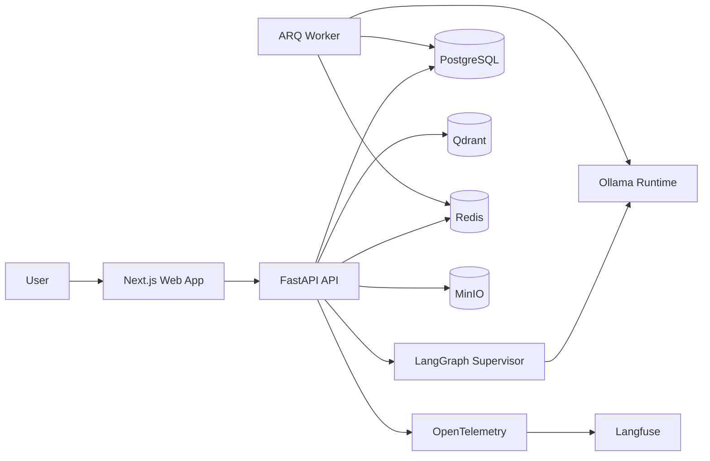
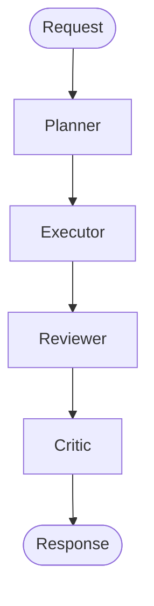

# Architecture Diagrams

## System Context

```mermaid
flowchart LR
  User --> Web[Next.js Web App]
  Web --> API[FastAPI API]
  API --> Supervisor[LangGraph Supervisor]
  Supervisor --> Ollama[Ollama Runtime]
  API --> PG[(PostgreSQL)]
  API --> QD[(Qdrant)]
  API --> Redis[(Redis)]
  API --> MinIO[(MinIO)]
  API --> OTel[OpenTelemetry]
  OTel --> Langfuse[Langfuse]
  Worker[ARQ Worker] --> Redis
  Worker --> PG
  Worker --> Ollama
```

## Supervisor Orchestration

```mermaid
flowchart TD
  Start([Request]) --> Planner
  Planner --> Executor
  Executor --> Reviewer
  Reviewer --> Critic
  Critic --> End([Response])
```
